<div align="center">

# EkSutra — Government Integration Platform

### *Ek Sūtra — "one thread."* A secure, protocol-agnostic integration layer that connects heterogeneous government systems through a unified API, a canonical data model, a workflow engine, and centralized status tracking.

[](#)
[](#)
[](#)
[](#)
[](#)
[](#)
[](#)

[Problem](#-problem-statement) • [Solution](#-solution) • [Architecture](#️-architecture) • [Workflow](#-integration-workflow) • [Security](#-authentication--authorization) • [Tech Stack](#️-technology-stack) • [API](#-api-endpoints) • [Getting Started](#-running-the-project) • [Roadmap](#-roadmap)

</div>

---

## Problem Statement

Government services rarely live in one system. A single citizen application can touch several independent departments, each with its own protocol, data format, and authentication model — REST/JSON here, SOAP/XML there, a legacy database somewhere else. Every new integration between two of these systems is built point-to-point, which means:

- Duplicate integration logic for every new system pairing
- No consistent view of an application's status across systems
- Difficult monitoring and poor traceability
- Inconsistent authentication and authorization per system
- No centralized audit trail
- No structured way to handle consent for cross-system data sharing

As the number of connected systems grows, the number of direct integrations grows even faster — and every one of them has to be maintained separately.

---

## Solution

**EkSutra** sits between government systems and the applications that consume them, so no system has to integrate directly with another. Every request flows through one platform that handles authentication, protocol translation, data normalization, workflow, consent, and audit — once, centrally — instead of every system reinventing it.

External systems plug into the platform through **adapters**, each responsible for translating that system's protocol and response shape into a single **canonical data model**. From there, every application — regardless of which systems it touched — has one consistent status, one history, and one place to be tracked from.

> **Integrate once. Connect many systems. Maintain one unified application lifecycle.**

---

## Architecture

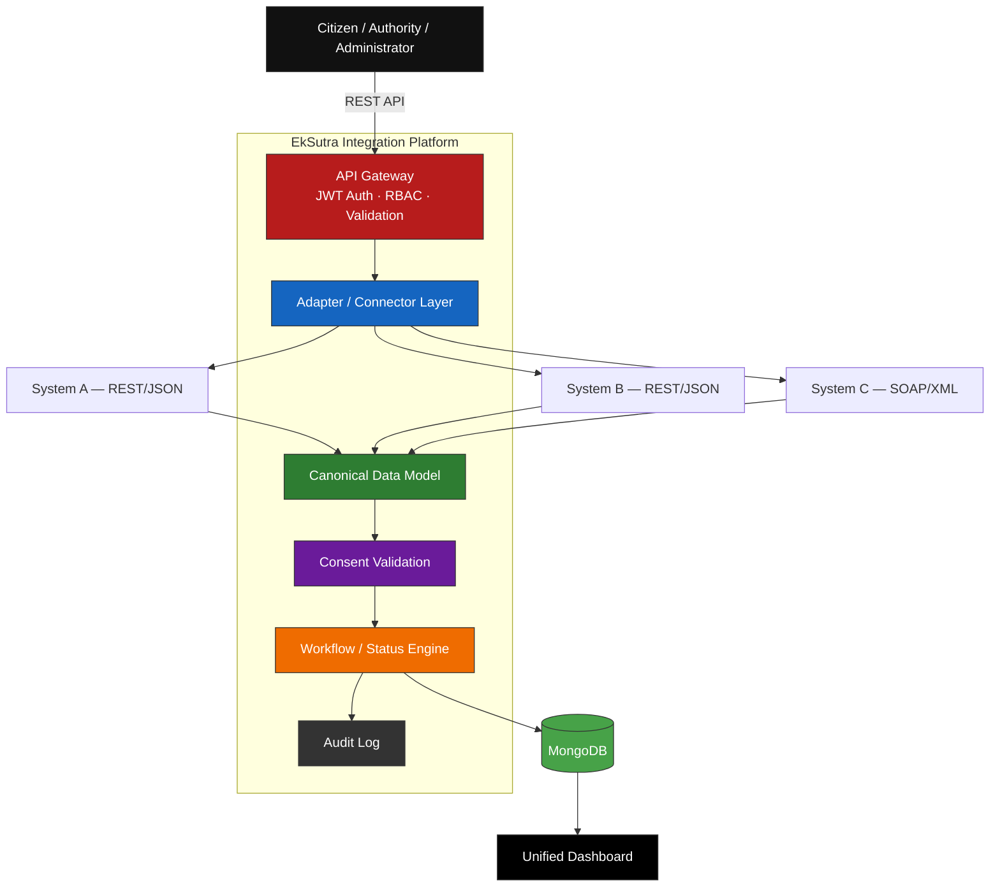

The platform hides the complexity of each connected system behind its adapter, and exposes one consistent application model to everything downstream of it — the dashboard, the audit trail, and any future consumer of the platform.

<p align="center">
  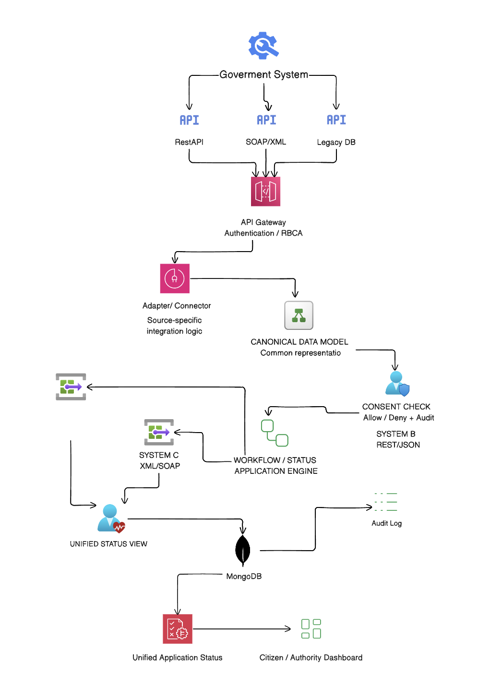
</p>

<p align="center"><sub>Full request path — from Government System through the API Gateway, Adapter/Connector layer, Canonical Data Model, Consent Check, and Workflow Engine, down to MongoDB, the audit log, and the unified dashboard.</sub></p>

---

## Key Objectives

| Objective | What it means |
|---|---|
| **Unified Integration** | One common interface in front of multiple heterogeneous systems |
| **Protocol Independence** | REST/JSON, SOAP/XML, and legacy systems all integrate through the same platform |
| **Canonical Data Model** | Every system's response is normalized into one shared representation |
| **Secure Access** | JWT authentication with role-based authorization on every endpoint |
| **Application Workflow** | A controlled lifecycle — `SUBMITTED → PROCESSING → APPROVED / REJECTED / ON_HOLD` |
| **Auditability** | Every status change is recorded — who, what, when, why |
| **Centralized Monitoring** | One place to observe request volume, latency, and integration health |

---

## Integration Workflow

A single application moves through the same pipeline regardless of which government system it eventually touches:

```mermaid
flowchart LR
    A[Request] --> B[Authenticate]
    B --> C[Authorize / RBAC]
    C --> D[Validate]
    D --> E[Select Adapter]
    E --> F[Call External System]
    F --> G[Transform Response]
    G --> H[Canonical Model]
    H --> I[Consent Check]
    I --> J[Workflow Engine]
    J --> K[Persist + Audit]
    K --> L[Dashboard]

    style B fill:#B71C1C,color:#fff
    style I fill:#6A1B9A,color:#fff
    style J fill:#EF6C00,color:#fff
```

---

## Canonical Data Model

Different systems describe the same application differently. System A might return flat JSON; System C, a SOAP-style XML payload with entirely different field names. EkSutra normalizes both into one internal shape before anything downstream ever sees them.

**System A (REST/JSON)**
```json
{
  "application_id": "APP1003",
  "citizen": "Priya Sharma",
  "status": "VERIFIED"
}
```

**System C (SOAP/XML)**
```xml
<Application>
    <ApplicationNumber>APP1003</ApplicationNumber>
    <Applicant>Priya Sharma</Applicant>
    <VerificationStatus>VERIFIED</VerificationStatus>
</Application>
```

**→ Canonical representation**
```json
{
  "applicationId": "APP1003",
  "applicantName": "Priya Sharma",
  "applicationStatus": "VERIFIED",
  "systems": [
    { "system": "SYSTEM-B", "eligible": true, "status": "VERIFIED" },
    { "system": "SYSTEM-C", "eligible": true, "status": "VERIFIED" }
  ]
}
```

The dashboard and workflow engine only ever work with this one shape — they don't need to know which systems were involved or what protocol each one spoke.

---

## Authentication & Authorization

EkSutra uses **JWT-based, stateless authentication** enforced through Spring Security.

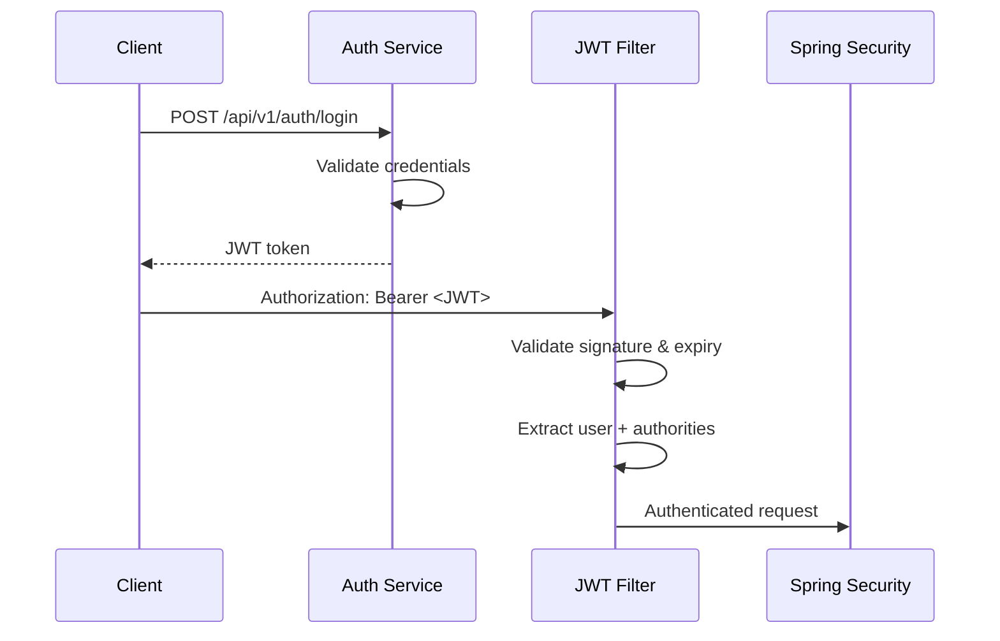

**Roles**

| Role | Can do |
|---|---|
| **Authority** | Submit applications · view/search applications · view application details · track status · place applications on hold · view status history |
| **Administrator** | Everything an Authority can do, plus: review, approve, and reject applications · monitor platform activity · access the admin dashboard |

---

## Application Lifecycle

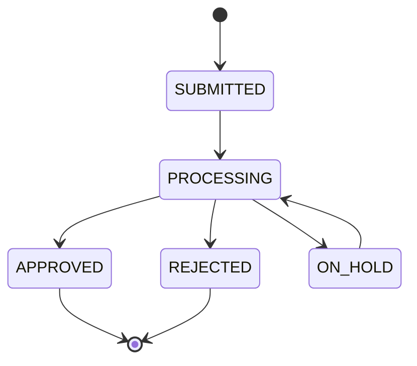

Every transition is written to the application's status history:

```json
{
  "status": "ON_HOLD",
  "reason": "Document requires manual verification",
  "changedBy": "authority1",
  "changedAt": "2026-09-01T23:09:13"
}
```

— giving a full answer to *who changed the application, what changed, why, and when.*

---

## Consent Management *(In Progress)*

Cross-system data sharing needs explicit consent, not an implicit assumption. The consent layer is designed as:

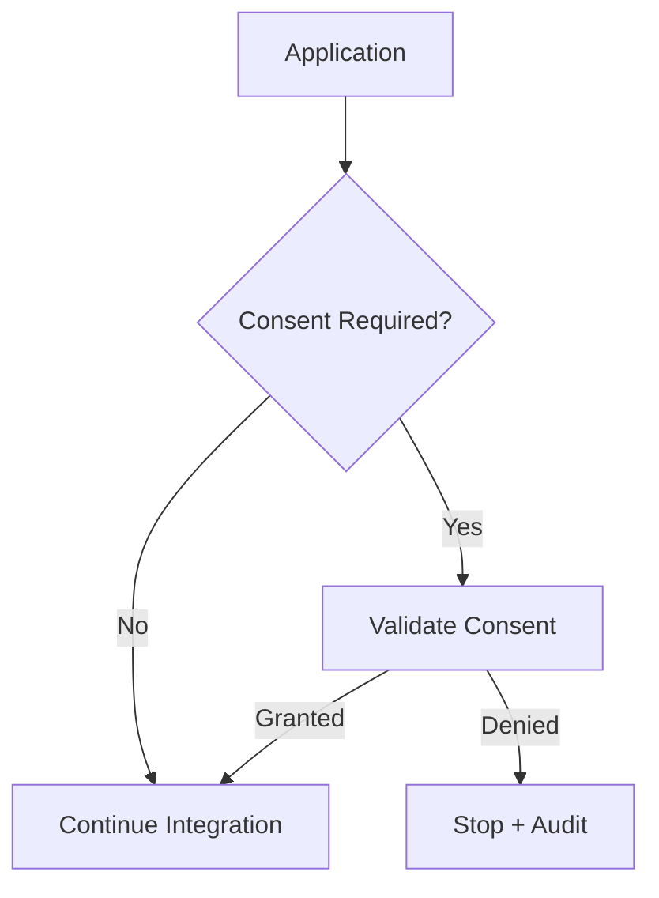

Planned capabilities: consent creation, validation, status tracking, revocation, and auditing — preventing any system from sharing data without an explicit, recorded grant.

> **Status:** designed, not yet integrated into the live request path — tracked in the [Roadmap](#-roadmap).

---

## Data Storage

EkSutra persists everything in **MongoDB**, chosen for its flexibility with the dynamic, per-system fields each adapter can return.

```
Application
├── Application ID          ├── Overall Eligibility
├── Citizen ID               ├── Application Status
├── Applicant Name           ├── System Responses
├── Date of Birth            ├── Created At / Updated At
├── Scheme Code               └── Status History
└── Correlation ID

Consent Records   ·   Audit Records   ·   Integration Logs
```

---

## Observability

Spring Boot Actuator is wired into the platform for standard application monitoring, exported through the Docker Compose–based Prometheus/Grafana setup already running in this repo:

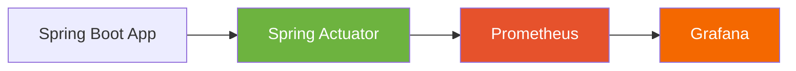

**Available today:** HTTP request metrics, response times, JVM memory and threads, CPU usage, garbage collection, and application health — all through Actuator's standard metrics.

**Planned — custom integration metrics:**

```
integration_requests_total
integration_success_total
integration_failure_total
integration_latency_seconds
system_requests_total
system_failures_total
```

These will power a dedicated Grafana dashboard tracking per-system success rate, latency, and availability — not just application-level health.

---

## Dashboards

**Authority Dashboard** — application overview (total, pending, on hold, approved, rejected), search by Application ID / Citizen ID / Correlation ID, and full application detail including system verification, eligibility, and status history.

**Administrator Dashboard** — everything the Authority dashboard shows, plus platform-wide activity monitoring and the approve/reject workflow.

```
┌────────────┐ ┌────────────┐ ┌────────────┐ ┌────────────┐
│   Total    │ │  Pending   │ │  Approved  │ │  Rejected  │
│    1204    │ │    183     │ │    912     │ │    109     │
└────────────┘ └────────────┘ └────────────┘ └────────────┘

Search: Application ID / Citizen ID / Correlation ID

Recent Applications
─────────────────────────────────────────────
APP1001    Processing
APP1002    Approved
APP1003    On Hold
APP1004    Rejected
```

---

## Technology Stack

| Layer | Technologies |
|---|---|
| **Backend** | Java, Spring Boot, Spring Security, Spring Data MongoDB, Spring Boot Actuator |
| **Auth** | JWT, BCrypt password hashing |
| **Database** | MongoDB |
| **Integration** | REST/JSON, SOAP/XML adapters, HTTP clients |
| **Monitoring** | Spring Boot Actuator, Prometheus, Grafana |
| **Containerization** | Docker, Docker Compose |
| **Frontend** | React (planned/in progress) |

---

## 📁 Project Structure

```
EkSutra/
├── src/
│   └── main/
│       ├── java/com.example.integration_plateform/
│       │   ├── config/           # Security configuration
│       │   ├── controller/       # Auth & Application controllers
│       │   ├── dto/               # Request/response models
│       │   ├── model/             # ApplicationRecord, StatusHistory, ...
│       │   ├── repository/
│       │   ├── security/          # JwtService, JwtAuthenticationFilter
│       │   ├── service/           # AuthService, ApplicationService, ...
│       │   └── integration/
│       │       ├── SystemA/
│       │       ├── SystemB/
│       │       └── SystemC/
│       └── resources/
│           └── application.properties
├── mock-systems/
│   ├── system-a/                 # REST/JSON mock
│   ├── system-b/                 # REST/JSON mock
│   └── system-c/                 # SOAP/XML mock
├── monitoring/
│   ├── prometheus/prometheus.yml
│   └── grafana/
├── docs/
│   ├── architecture.png
│   ├── workflow.png
│   └── deployment-architecture.png
├── docker-compose.yml
├── Dockerfile
├── pom.xml
└── README.md
```

> Package structure will continue to evolve as the platform grows.

---

## Mock Government Systems

To demonstrate real heterogeneous integration rather than a single mocked API, three intentionally different mock systems back the platform:

| System | Protocol | Format |
|---|---|---|
| **System A** | REST | JSON |
| **System B** | REST | JSON |
| **System C** | SOAP | XML |

---

## API Endpoints

**Authentication**
```http
POST /api/v1/auth/signup
POST /api/v1/auth/login
```
```json
{ "username": "authority1", "token": "<JWT_TOKEN>", "role": "ROLE_AUTHORITY" }
```

**Applications**
```http
POST   /api/v1/integration/application
GET    /api/v1/applications/{applicationId}
GET    /api/v1/applications
PATCH  /api/v1/applications/{applicationId}/status
```

Submit example:
```json
{
  "citizenId": "CT104",
  "applicantName": "Priya Sharma",
  "dateOfBirth": "2003-05-12",
  "schemeCode": "EDU01"
}
```

Status update example:
```json
{ "status": "ON_HOLD", "reason": "Document requires manual verification" }
```

**Search**
```http
GET /api/v1/applications?applicationId=APP1003
```
Supports lookup by Application ID, Citizen ID, or Correlation ID.

---

## 🐳 Running the Project

**Prerequisites:** Java · Maven · Docker · Docker Compose · MongoDB

```bash
# Clone the repository
git clone https://github.com/arpanelfranklin/EkSutra.git
cd EkSutra

# Start MongoDB (and monitoring stack) via Docker Compose
docker compose up -d
docker ps

# Run the Spring Boot application
./mvnw spring-boot:run
```

The backend runs on `http://localhost:8080`.

**Authenticate and call a protected endpoint:**
```http
POST /api/v1/auth/login
```
```http
Authorization: Bearer <JWT_TOKEN>
```

---

## Testing with Postman

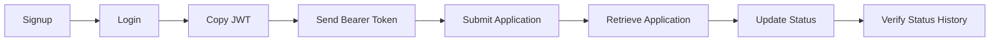

---

## Security Principles

- JWT-based, stateless authentication
- Role-based authorization (RBAC) on every endpoint
- BCrypt password hashing
- Request validation on all inputs
- Controlled, auditable status transitions
- Consent-aware design for cross-system data sharing

---

## Why an Integration Platform?

**Without one**, every new system multiplies the number of point-to-point integrations that need to be built and maintained:

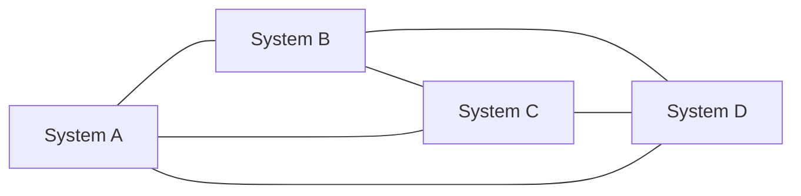

**With EkSutra**, every system integrates once, with the platform:

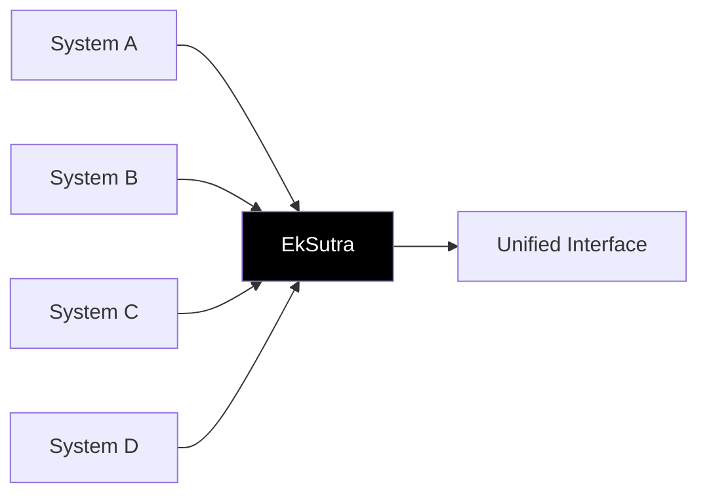

| Benefit | Why it matters |
|---|---|
| **Loose Coupling** | Systems never need to know about each other |
| **Protocol Transformation** | REST/JSON and SOAP/XML meet through one common layer |
| **Extensibility** | New systems plug in as a new adapter — nothing else changes |
| **Centralized Security** | One authentication and authorization layer, not one per system |
| **Traceability** | Every status change is auditable |
| **Observability** | Platform and integration health monitored in one place |

---

## Future Architecture

Beyond the current MVP, the intended production deployment looks like this:

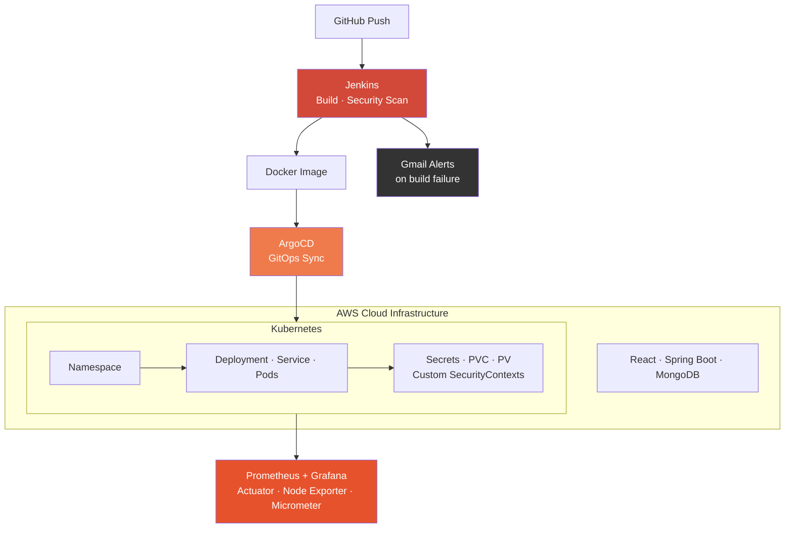

This includes auto-scaling and high-availability orchestration via Kubernetes, hardened manifests with custom SecurityContexts, zero-downtime GitOps deployments via ArgoCD, and automated build-failure alerting over email. **None of this is part of the current working repository** — it's the direction the platform is being built toward.

<p align="center">
  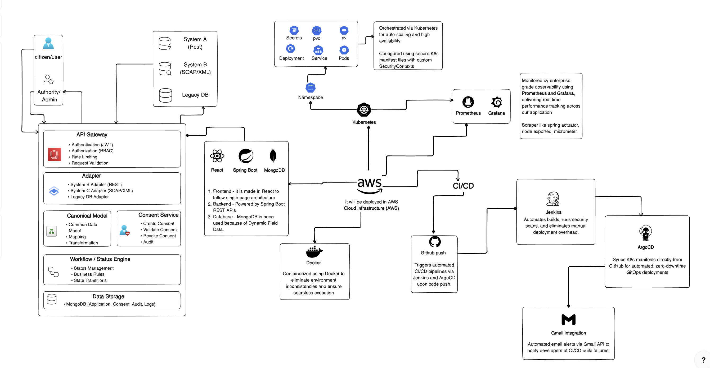
</p>

---

## Roadmap

**Implemented**
- [x] Spring Boot backend with layered architecture
- [x] MongoDB integration
- [x] JWT authentication & validation, Spring Security, role-based authorization
- [x] Application model and integration API
- [x] Mock Systems A, B, and C (REST/JSON and SOAP/XML)
- [x] Canonical application representation
- [x] Application status management — `APPROVED` / `REJECTED` / `ON_HOLD` workflow
- [x] Status history
- [x] Dashboard statistics API/model
- [x] Spring Boot Actuator
- [x] Docker Compose monitoring setup

**In Progress**
- [ ] Consent management and consent validation in the integration workflow
- [ ] Custom Prometheus integration metrics (request count, latency, success/failure rate)
- [ ] Custom Grafana dashboard for integration health
- [ ] Complete React frontend
- [ ] Advanced application search
- [ ] End-to-end integration testing

**Future Enhancements**
- [ ] Retry mechanism & circuit breaker
- [ ] Distributed tracing and centralized logging
- [ ] Alerting
- [ ] Rate limiting & caching
- [ ] Asynchronous integration via messaging
- [ ] Kubernetes deployment on AWS
- [ ] API Gateway integration

---

## Vision

EkSutra doesn't replace existing government infrastructure — it bridges it. The goal is a secure, extensible, observable integration layer that lets modern applications talk to legacy and modern government systems alike, through one unified interface and one unified application lifecycle.

---

## Team

Built as part of **Smart India Hackathon (SIH)**, with team members working across Backend Engineering, Frontend Development, Integration Architecture, DevOps & Infrastructure, Research, and Documentation.

---

## License

This project is developed for educational, prototyping, and hackathon purposes.

```
MIT License
```

---

<div align="center">

### If EkSutra's approach to heterogeneous system integration was useful to you, consider giving it a star.

</div>